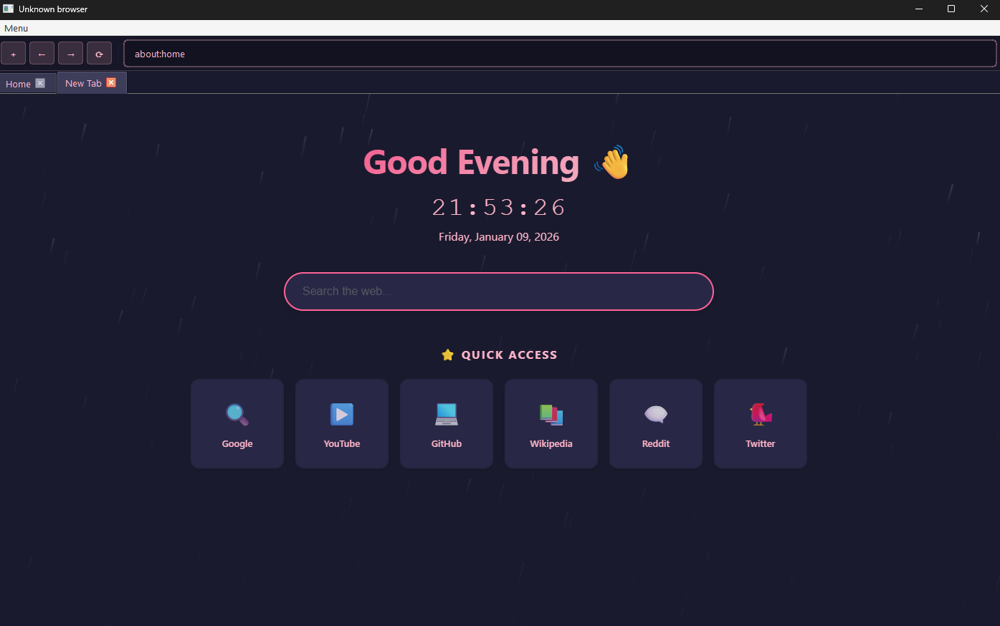

This project is a custom Chromium-based browser built using Python. It started as a personal experiment to understand how browsers work under the hood, and it’s grown into a fully usable application with its own system, settings, and UI logic.

The goal isn’t to replace Chrome or Edge. It’s to provide a lightweight, modifiable browser that gives more control to the user and the developer. Everything is built with simplicity and flexibility in mind.

But the idea is big, this is a project i want to work on.

